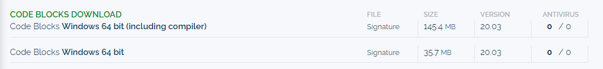
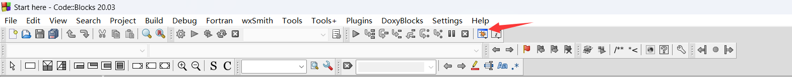
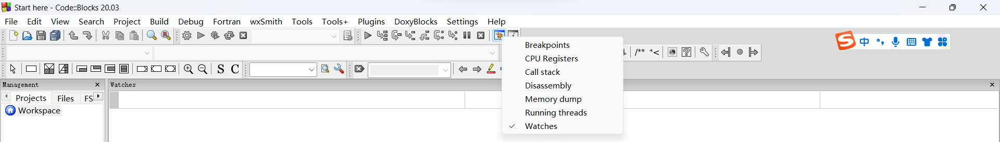

# 第一章 编程工具的安装与使用（补充）

> By TA 刘睿博 于硕 余翔

> 这是关于实验手册第一章内容的补充，一些书中介绍很详细的编译器这里会省略，Mac系统的环境配置有问题请联系助教

## CodeBlocks

### Pros

+ 轻量级的编程工具（100MB左右）
+ 对初学者友好
+ 默认使用GCC编译器（在安装时会附带）

### Cons

+ 没有为Win11开发专用版本
+ 自带的GCC编译器无法被VSCode用于编译cpp文件
+ 没有中文版本:thumbsdown:
+ 语法标准比较严格，一些新标准的语法/关键字不能使用

### Note

+ 助教在安装Codeblocks最新发行版本的时候，没有自动安装MinGW调试器，需要到MinGW官网自行下载[MinGW - Minimalist GNU for Windows download | SourceForge.net](https://sourceforge.net/projects/mingw/) 可以参考[MinGW-w64安装教程——著名C/C++编译器GCC的Windows版本 - 知乎 (zhihu.com)](https://zhuanlan.zhihu.com/p/76613134) 安装。**不要安装成32位版本了！**

+ ~~调试的时候不要看寄存器，否则你可能再也打不开Codeblocks了~~

+ codeblocks官网下载的时候会默认下载无编译器/调试器的发行版本，建议使用下图中的第一个版本

  

  

### Debug

---

**使用MinGW调试时工程文件路径及gdb.exe文件(在MinGW调试器中)路径不能含有中文、空格、短横线等非法字符，应只含有（大小写）字母数字和下划线，否则会报以下错误**

> Starting the debugger failed: No executable specified, use `target exec'

可参考[c - Starting the debugger failed: No executable specified, use `target exec' - Stack Overflow](https://stackoverflow.com/questions/66884293/starting-the-debugger-failed-no-executable-specified-use-target-exec) 解决

**监视窗口打开方式**

将Watches功能打开即可，这里会自动监视所有的局部变量的值，若想监视其他值请自行输入。

---

## VSCode

### Pros

+ 文本编辑器功能齐全、强大

+ 社区插件众多

+ 可用于开发近乎所有语言

### Cons

+ C编译环境配置比较繁琐

---

> tips: 强烈推荐计算机相关专业的同学安装VSCode并配置C/C++环境

可参照《计算机程序设计学习实践实验指导书》与 [VsCode安装和配置c/c++环境（超完整，小白专用）_vscode c++环境_黄化的多多的博客-CSDN博客](https://blog.csdn.net/weixin_48468423/article/details/118950592) 实现，这是一份较为详尽的vscode配置C/C++环境的教程。

> tips: 使用vscode时运行程序黑框一闪而过，看不到输出结果怎么办

可在头文件加上#include<stdlib.h>，main函数里return上面加上system("pause");  可防止程序窗口闪退

> tips: 如何切换在终端显示输出或在黑框中显示输出

查看launch.json文件的externalConsole选项，这里为true则会在外部打开黑框，为false则会在vscode内的终端进行输出

---

## Linux GCC

助教们一致认为不会有同学在刚入学的时候装虚拟机，毕竟命令行对于大家来说可能很不友好。但是Linux下VSCode的配置很容易，我们可以采取一个折衷的办法：访问[首页 - Vlab 实验中心 (ustc.edu.cn)](https://vlab.ustc.edu.cn/) 并在虚拟机管理中创建虚拟机。

---

## 一些题外话

不久后我们就将学到C语言的各种语法与库函数，课上不可能详尽的讲解这些函数，可以访问[cppreference.com(汉化版)](https://zh.cppreference.com/w/首页)或者[cppreference.com(英文原版)](https://en.cppreference.com/w/)查询。

助教认为：代码能力的增长主要靠debug。狭隘地说，当你花费越长的时间代价解决一个问题，你对它的印象就越深刻(因为这可能会令你懊恼)，~~但是不要因此而咒骂助教和老师~~。当你掌握了debug的方法后，发现bug和解决bug的问题会大大降低。~~总之，debug可能是痛苦的，但是写bug是快乐的~~。

我们鼓励大家向助教提问（如果一个助教没有及时回复问题，~~请放心他还活着，~~请向其他清醒的助教提问），但是如果问题过于简单或者书本上有介绍，我们会给出思路或者表明页码，请谅解我们避而不答~~

最后希望能和大家愉快的完成程序设计的学习(debug除外 :broken_heart: )
