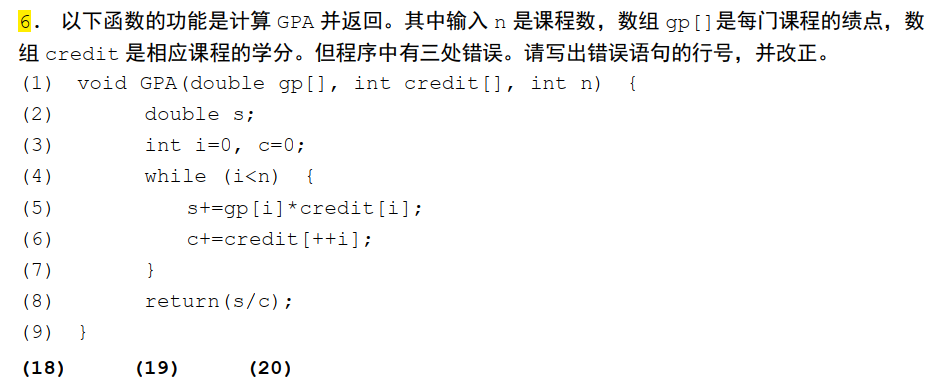

## A卷

### 4.1


---

### 4.3


---

### 4.5


---

### 4.6




---

### 5.1

```C
/*已知现有 1 元、 5 元、 20 元、 50 元面值的人民币的张数分别为 3、 3、 5、
4。 请补充代码，完成如下功能：
（1）从键盘输入商品价格（假设输入是 0~300 的整数）；
（2）若能用现有的人民币付款， 打印最少需要多少张纸币，以及各个面值的纸币张数。 若最少纸币
的支付方案有重复，仅给出一种即可;
（3）若不能用现有的人民币付款， 仅打印“无法支付！”。
例如输入 70 元，打印“最少需要 2 张，其中 50 元 1 张， 20 元 1 张， 5 元 0 张， 1 元 0 张”。若输
入 84 元，则打印“无法支付！”。*/
#include <stdio.h>
#define N1 3
#define N5 3
#define N20 5
#define N50 4
int main()
{
    int price; // 存放商品价格的变量
    // 需补充的函数语句
    int n1, n5, n20, n50;
    int flag = 0;
    scanf("%d", &price);
    for (n50 = 0; n50 <= N50; n50++)
    {
        for (n20 = 0; n20 <= N20; n20++)
        {
            for (n5 = 0; n5 <= N5; n5++)
            {
                for (n1 = 0; n1 <= N1; n1++)
                {
                    if (n50 * 50 + n20 * 20 + n5 * 5 + n1 == price)
                    {
                        flag = 1;
                        break;
                    }
                }
                if (flag == 1)
                    break;
            }
            if (flag == 1)
                break;
        }
        if (flag == 1)
            break;
    }
    if (flag == 1)
    {
        printf("最少需要 %d 张，其中 50 元 %d 张， 20 元 %d 张， 5 元 %d 张， 1 元 %d 张\n", n50 + n20 + n5 + n1, n50, n20, n5, n1);
    }
    else
    {
        printf("无法支付！\n");
    }
    return 0;
}

int cal(int price, int* n50, int* n20, int* n5, int* n1){
    *n50 = price / 50;
    if (*n50 > N50) {
        *n50 = N50;
    }
    price -= *n50 * 50;
    *n20 = price / 20;
    if (*n20 > N20) {
        *n20 = N20;
    }
    price -= *n20 * 20;
    *n5 = price / 5;
    if (*n5 > N5) {
        *n5 = N5;
    }
    price -= *n5 * 5;
    if (price > N1){
        return 0;
    }
    else {
        *n1 = price;
        return 1;
    }
}
```

### 5.2

```C
/*以下函数功能为：用给定的子串 sub，从前向后替换字符串 src 中的所有子串 word，并将结果字
符串存放到字符数组 dest 中。为简化问题，假定：
（1） sub 的长度<=word 的长度<=10，且两个子串没有相同的字符；
（2） src 的长度<=dest 的长度；
（3）允许使用字符串库函数，如 strcmp()、 strcpy()、 strlen()、 strncpy()等。
比如在"fireworks workman work hard"中用"fun"替换"work"后得到"firefuns funman
fun hard"。 请补充以下函数的代码。*/
#include <string.h>
void replace(char *src, char dest[], char *sub, char *word)
{
    char *p = dest;
    for (int i = 0; i < strlen(src) - str(sub); i++)
    {
        if (strncmp(src + i, sub, strlen(sub))){
            strncpy(p, word, strlen(word));
            p += strlen(word);
            i += strlen(sub);
        }
        else {
            *(p++) = src[i];
        }
    }

}
```

### 5.3

```C
#include<stdio.h>
#include<stdlib.h>
struct student { //学生信息
    int Num; //学号
    float score; //成绩
    struct student *next;
};
struct student *create();
float average(struct student *head);
struct student *excellent(struct student *head, float ave);
int main() {
    struct student *head, *excellent_head;
    head=create();
    excellent_head=excellent(head, average(head));
    return 0;
}
struct student *create(){
    struct student *tail, *p1;
    tail = p1 = (struct student *)malloc(sizeof(struct student));
    scanf("%d %f", &p1->Num, &p1->score);
    for(int i = 0; i < 19; i++){
        p1 = (struct student *)malloc(sizeof(struct student));
        scanf("%d %f", &p1->Num, &p1->score);
        tail->next = p1;
        tail = p1;
    }
}
float average(struct student *head){
    float sum = 0;
    struct student *p;
    p = head;
    while(p != NULL){
        sum += p->score;
        p = p->next;
    }
    return sum / 20;
}

struct student *excellent(struct student *head, float ave) {
//head 为链表头， ave 为学生平均成绩
//实现功能：从该链表中找出所有超过平均成绩的优秀学生，按成绩从高到低的顺序创建一个
//新链表， 链表头指向成绩最高的学生，并返回新链表头。
    struct student *p, *q, *head1;
    p = head;
    head1 = NULL;
    while(p != NULL){
        if(p->score > ave){
            q = (struct student *)malloc(sizeof(struct student));
            q->Num = p->Num;
            q->score = p->score;
            q->next = head1;
            head1 = q;
        }
        p = p->next;
    }
    return head1;
}
```

## B卷

### 4.1


---

### 4.5


